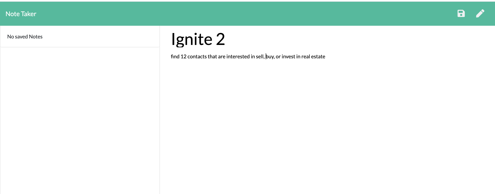
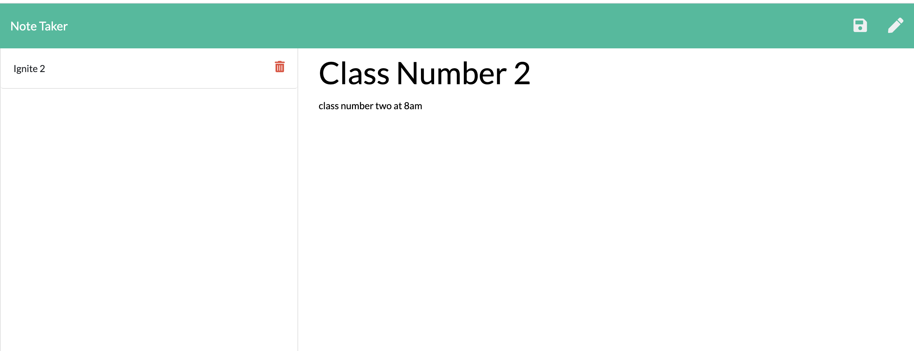

# Note-Taker

## Description

Note taker is an application to write, save, and delete notes. This application used express to save and retrieve notes from JSON file.

The frontend of this application has already been created, the work is to buid the backend and connect the two.

### The following HTML routes should be created:

  * GET `/notes` - Should return the `notes.html` file.

  * GET `*` - Should return the `index.html` file

### The following API routes should be created:

  * GET `/api/notes` - Should read the `db.json` file and return all saved notes as JSON.

  * POST `/api/notes` - Should receive a new note to save on the request body, add it to the `db.json` file, and then return the new note to the client.

  * DELETE `/api/notes/:id` - Should receive a query parameter containing the id of a note to delete. This means you'll need to find a way to give each note a unique `id` when it's saved. In order to delete a note, you'll need to read all notes from the `db.json` file, remove the note with the given `id` property, and then rewrite the notes to the `db.json` file.

## User Story

As user I want to be able to write and save notes but also be able to delete them. As user I want be able to organize my thoughs and have a successful application to organize and keep track of tasks and ideas.

## Business Context

In the business context is important to keep track of all the information. In order to succesfully follow all the tasks without forgetting anything is important to have persistent notes and be able to go back to them when is needed.

## Images

## URL of the deployed application - Heroku

## URL of the Github respository
<https://github.com/jenniferjael/Note-Taker>

